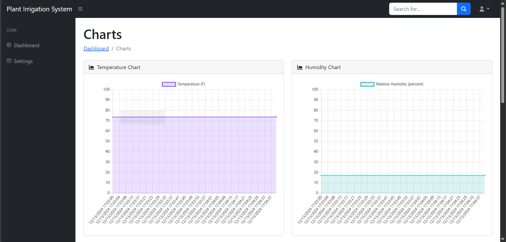
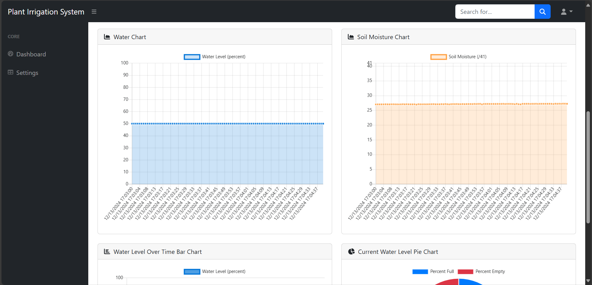
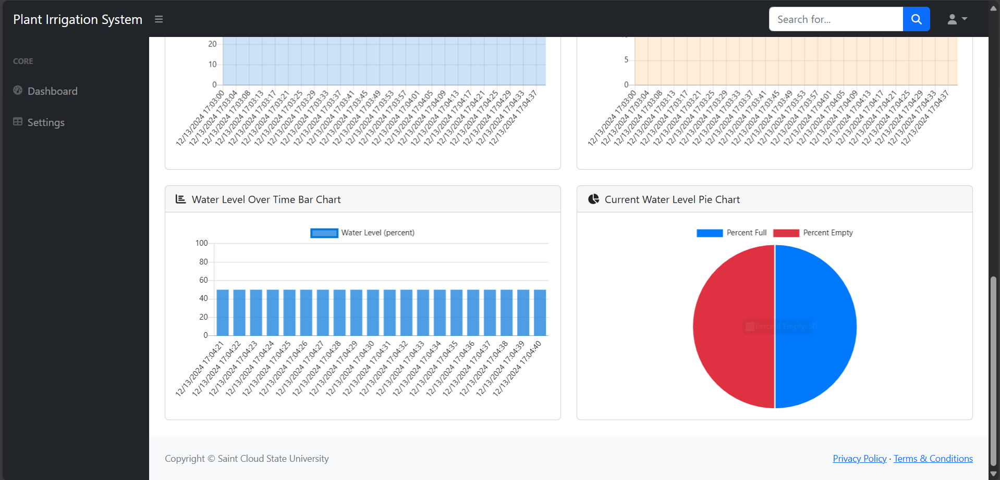
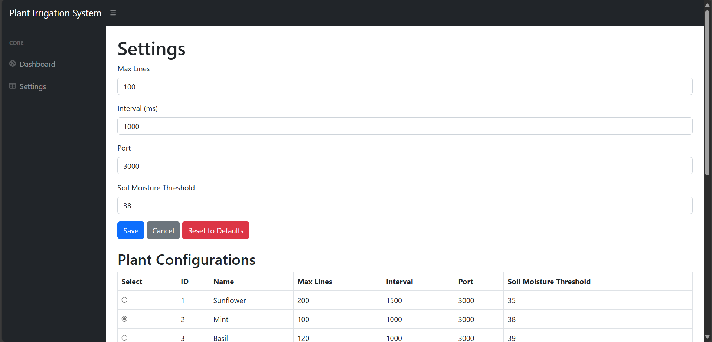
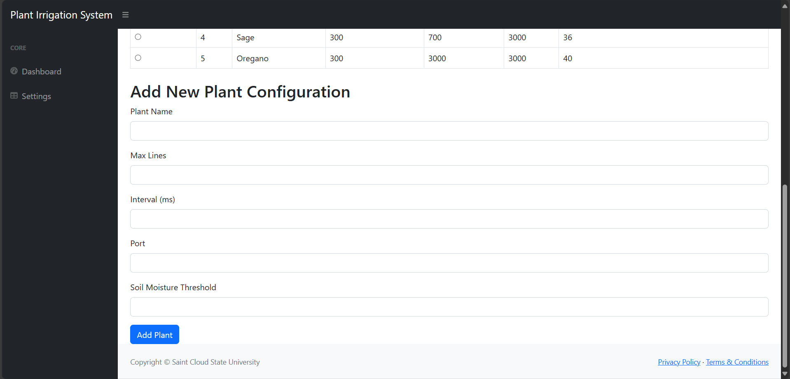

# Automated Indoor Plant Irrigation System

The objective for this project is to design and implement an Automated Indoor Plant Irrigation System to meet the irrigation and monitoring needs of home plant growers for maintaining the optimal moisture levels of their indoor plants. The system incorporates a server, microcontroller, temperature sensor, relative humidity sensor, soil moisture sensor, three water level sensors, two water pumps, two water reservoirs, tubing, and a power supply. The software aspects include a database of environmental logs, database of plant types, current configuration settings file, and a GUI website which is hosted on a server and accessible on mobile and desktop. Our approach will reduce the risk of overwatering or underwatering plants and provides peace of mind should the owner be away for periods of time. The data logs provide environmental information for observation of the plants’ soil moisture, temperature, humidity level, water level of the reservoir. Overall, this project aims to provide a comprehensive automated solution for indoor plant watering.

Code is forked and modified from [Start Bootstrap - SB Admin](https://startbootstrap.com/template/sb-admin/). [SB Admin](https://startbootstrap.com/template/sb-admin/) is an open source, admin dashboard template for [Bootstrap](https://getbootstrap.com/) created by [Start Bootstrap](https://startbootstrap.com/).

## Preview

### Dashboard

### Settings

**[View Live Preview](https://jmcdon17.github.io/AutoPlantIrrigMonSys-website/dist/)**

To begin using this template, choose one of the following options to get started:

## Dependencies

bootstrap: v5.2.3
chart.js: v4.4.2
express: v4.19.2
node.js: v18.20.2

## Download and Installation

* Clone the repo: `git clone https://github.com/jmcdon17/AutoPlantIrrigMonSys-website.git`
* [Fork, Clone, or Download on GitHub](https://github.com/jmcdon17/AutoPlantIrrigMonSys-website)

## Usage

### Basic Usage

After downloading, simply edit the HTML and CSS files included with `dist` directory. These are the only files yu need to worry about, you can ignore everything else! To preview the changes you make to the code, you can open the `index.html` file in your web browser.

### Advanced Usage

Clone the source files of the theme and navigate into the theme's root directory. Run `npm install` and then run `npm start` which will open up a preview of the template in your default browser, watch for changes to core template files, and live reload the browser when changes are saved. You can view the `package.json` file to see which scripts are included.

#### npm Scripts

* `npm run build` builds the project - this builds assets, HTML, JS, and CSS into `dist`
* `npm run build:assets` copies the files in the `src/assets/` directory into `dist`
* `npm run build:pug` compiles the Pug located in the `src/pug/` directory into `dist`
* `npm run build:scripts` brings the `src/js/scripts.js` file into `dist`
* `npm run build:scss` compiles the SCSS files located in the `src/scss/` directory into `dist`
* `npm run clean` deletes the `dist` directory to prepare for rebuilding the project
* `npm run start:debug` runs the project in debug mode
* `npm start` or `npm run start` runs the project, launches a live preview in your default browser, and watches for changes made to files in `src`

You must have npm installed in order to use this build environment.

## About

### Automated Indoor Plant Irrigation System

Automated Indoor Plant Irrigation System was created by and is maintained by:

* Justin McDonald
* Kalid Ali
* Benjamin Uecker
* Duc Tran

In partial fulfillment of the requirements for the degree of Bachelor of Science in the Department of Electrical and Computer Engineering, St. Cloud State University, St. Cloud, MN.

#### Senior Design Project Committee

[Dr. Yi Zheng](https://web.stcloudstate.edu/zheng/) (advisor), [Dr. Aiping Yao](https://www.stcloudstate.edu/ece/faculty-staff.aspx), [Dr. Andrew A. Anda](https://www.stcloudstate.edu/csit/faculty-staff.aspx)

Automated Indoor Plant Irrigation System is based on the framework Start Bootstrap.

### Start Bootstrap

* [https://davidmiller.io](https://davidmiller.io)
* [https://twitter.com/davidmillerhere](https://twitter.com/davidmillerhere)
* [https://github.com/davidtmiller](https://github.com/davidtmiller)

Start Bootstrap is based on the [Bootstrap](https://getbootstrap.com/) framework created by [Mark Otto](https://twitter.com/mdo) and [Jacob Thorton](https://twitter.com/fat).

## Copyright and License

Copyright 2013-2025 Saint Cloud State University. Code released under the MIT license.
